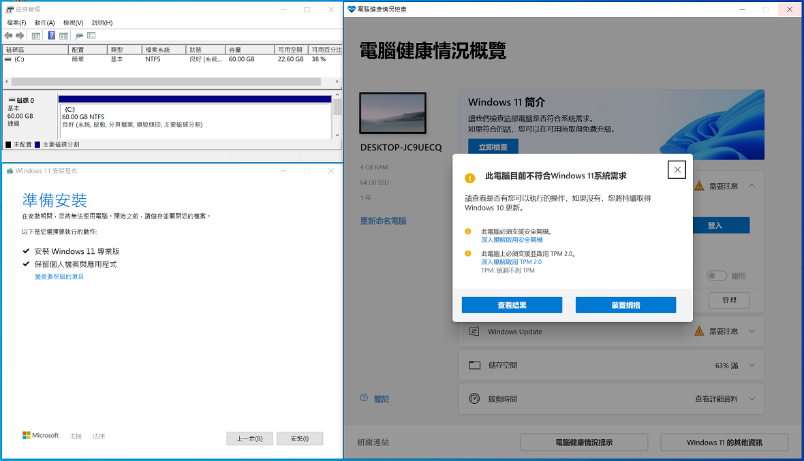

## 跳過 Windows11 更新的硬體限制



自行下載ISO檔之後把路徑打上去即可。

```ps1
irm bit.ly/BypassWin11|iex; BypassWin11 -IsoFile "D:\Win11_Chinese(Traditional)_x64v1.iso"
```

> 繞過硬體限制的辦法我是直接拿 rufus 的方法來用的  
> [https://github.com/pbatard/rufus](https://github.com/pbatard/rufus)

<br><br><br>


### 電腦健康狀態檢查 (WindowsPCHealthCheckSetup)
官方載點：https://www.microsoft.com/en-us/software-download/windowsinsiderpreviewpchealth

```ps1
irm bit.ly/BypassWin11|iex; Install-WindowsPCHealthCheckSetup
```